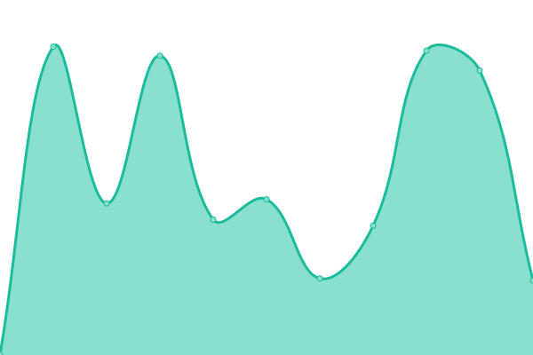
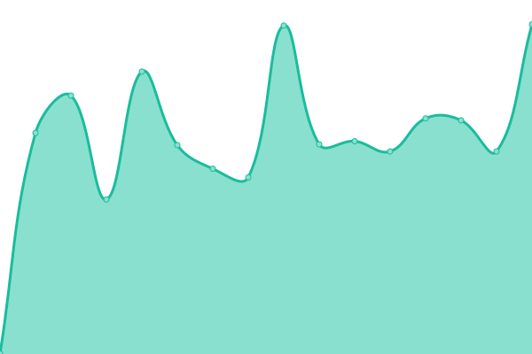

# [📈 Live Status](https://status.jangle.ink): <!--live status--> **🟧 Partial outage**

This repository contains the open-source uptime monitor and status page for [unremarkable-project](https://status.jangle.ink), powered by [Upptime](https://github.com/upptime/upptime).

With [Upptime](https://upptime.js.org), you can get your own unlimited and free uptime monitor and status page, powered entirely by a GitHub repository. We use [Issues](https://github.com/unremarkable-project/uptime/issues) as incident reports, [Actions](https://github.com/unremarkable-project/uptime/actions) as uptime monitors, and [Pages](https://status.jangle.ink) for the status page.

<!--start: status pages-->
<!-- This summary is generated by Upptime (https://github.com/upptime/upptime) -->
<!-- Do not edit this manually, your changes will be overwritten -->
<!-- prettier-ignore -->
| URL | Status | History | Response Time | Uptime |
| --- | ------ | ------- | ------------- | ------ |
|  [Landing Page (Website)](http://jangleinc.com) | 🟩 Up | [landing-page-website.yml](https://github.com/unremarkable-project/uptime/commits/HEAD/history/landing-page-website.yml) | 

 253ms
     
 | 

<a href="https://status.jangle.ink/history/landing-page-website">100.00%</a>
    

|  [Mail Server](https://mailgun.com) | 🟩 Up | [mail-server.yml](https://github.com/unremarkable-project/uptime/commits/HEAD/history/mail-server.yml) | 

 1741ms
     
 | 

<a href="https://status.jangle.ink/history/mail-server">100.00%</a>
    

|  [File Server](http://files.jangle.ink) | 🟥 Down | [file-server.yml](https://github.com/unremarkable-project/uptime/commits/HEAD/history/file-server.yml) | 

 577ms
     
 | 

<a href="https://status.jangle.ink/history/file-server">99.80%</a>
    

|  [Web Server](http://jangle.ink) | 🟩 Up | [web-server.yml](https://github.com/unremarkable-project/uptime/commits/HEAD/history/web-server.yml) | 

 219ms
     
 | 

<a href="https://status.jangle.ink/history/web-server">100.00%</a>
    

<!--end: status pages-->

[**Visit our status website →**](https://status.jangle.ink)

## 📄 License

- Powered by: [Upptime](https://github.com/upptime/upptime)
- Code: [MIT](./LICENSE) © [unremarkable-project](https://status.jangle.ink)
- Data in the `./history` directory: [Open Database License](https://opendatacommons.org/licenses/odbl/1-0/)
